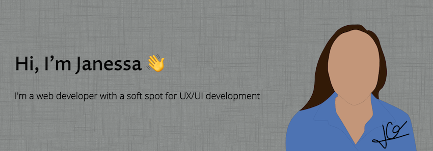

🚀 I'm currently a Developer Experience Engineer at [Apollo GraphQL](https://www.apollographql.com/)<br/>
💻 [https://janessagarrow.com](https://janessagarrow.com/)<br/>
🐦 [https://twitter.com/JanessaGarrow](https://twitter.com/JanessaGarrow)

## ✍️ Latest Blog posts 
<!-- BLOG-POST-LIST:START -->
- [Layout Animations with Framer Motion](https://janessagarrow.com/blog/gatsby-framer-motion-animate-shared-layout/)
- [Page Transitions with Gatsby + Framer Motion](https://janessagarrow.com/blog/gatsby-framer-motion-page-transitions/)
- [Odyssey](https://janessagarrow.com/portfolio/odyssey/)
<!-- BLOG-POST-LIST:END -->

## 🔨 This week's tools
<!--START_SECTION:waka-->
```text
JavaScript   5 hrs 55 mins   █████████████░░░░░░░░░░░░   52.60 % 
MDX          1 hr 47 mins    ████░░░░░░░░░░░░░░░░░░░░░   15.97 % 
TypeScript   1 hr 27 mins    ███▒░░░░░░░░░░░░░░░░░░░░░   12.96 % 
JSON         1 hr 14 mins    ██▓░░░░░░░░░░░░░░░░░░░░░░   11.05 % 
Other        17 mins         ▓░░░░░░░░░░░░░░░░░░░░░░░░   02.64 % 
```
<!--END_SECTION:waka-->

## 👩‍💻 Favorite tools

<div align="center">
   
  
</div>

## ⚡ Fun facts
- 👩‍🎓 I have two BA's in Linguistics and Italian Studies
- 👨‍💻 My husband, [Peter Garrow](https://petergarrow.com/), is also a web developer
- 👨‍👩‍👧 I'm a mom 
- 📺 I'm an avid Avatar the Last Airbender fan